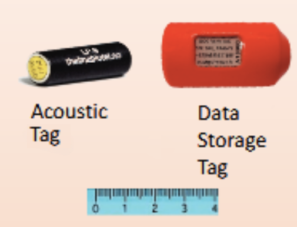
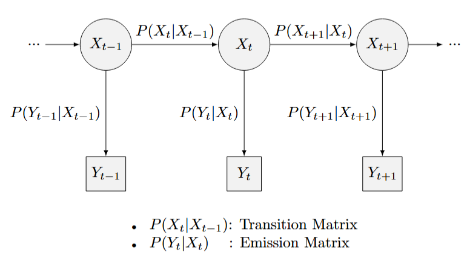

# Summary

Geo-referenced data plays an important role in understanding and conserving natural resources, particularly when investigating biological phenomena such as fish migration and its habitat.
Biologging, the practice of attaching small devices (called _tags_) to animals for behavior tracking and environmental data collection, proves to be invaluable in this field.
However, directly tracking fish underwater presents persistent challenges.
To address this, models have emerged to estimate fish locations by correlating data from biologging devices — such as temperature and pressure readings — with oceanic temperature and bathymetry models.
Beside the difficulty of working with vast earth science datasets (due to their size and diversity), there is no open source implementation for modeling fish locations.
Yet, these fish geolocation models are critical for better understanding fish behavior and are nowadays seen as a powerful tool by policy makers for fish stock management and preservation.

On one hand, the [Pangeo](https://www.pangeo.io/) ecosystem was created by a community of engineers and geoscientists specifically to address the big earth data analysis related challenges.
Utilizing pangeo, the **pangeo-fish** software is a Python package for biologging data analysis and fish location estimation.
It is dedicated to biologists to manage and process the result of their biologging (or _tagging_) campaigns.

<!-- The accuracy and resolution of these reference datasets significantly impact the precision of reconstructed fish trajectories. Despite recent advancements in earth observation technology and modeling methodologies like digital twins, accessing vast earth science datasets remains cumbersome due to their size and diversity. More crucially, there is no open source for modeling fish locations. Additionally, the computational demands for analysis pose technical barriers. The [Pangeo](https://www.pangeo.io/) ecosystem was created by a community of engineers and geoscientists specifically to address these big earth data analysis challenges. The **pangeo-fish** software is a Python package that utilizes Pangeo to leverage advancements in biologging data analysis for fish. -->

# Statement of Need

Biologging describes the process of attaching small devices to animals to monitor their behavior and collect environmental data.
It is an important tool for understanding animal habitats as well as behavior and migration patterns.
However, unlike terrestrial animals, whose positions can be directly tracked using GPS technology, tracking fish underwater presents significant challenges.
This limitation hinders the accurate delineation of protected areas, which is crucial for the protection of important fish habitats and fish exploitation.
To address this issue, various tagging experiments have been conducted on a variety of fish species [@spanish_tagging; @skagerrak_tagging], and methods have been proposed for approximating the fish locations, referred to as geolocation models [@pontual_seabass_migration_2023; @woillez_hmm-based_2016].

{ width=35% }

Archival tags and acoustic tags are two commonly tagging systems used in biologging campaigns.
Archival tags — also called Data Storage Tag (DST) — record and store a wide range of data such as temperature, pressure or salinity until their battery expires (whose timespan usually ranges from 6 months to 2 years).
The main challenge of DSTs are their retrieval, which mostly depends on fishers and the local population living next to the coast.
Tagging campaigns usually address this challenge by promoting and possibly rewarding tag or fish captures (see for instance, the advertisement from the [FISH-INTEL](https://www.france-energies-marines.org/en/projects/fish-intel/) campaign on \autoref{fig:fishintel}).
Acoustic tags work differently, since they emit signals that can be detected by detection devices when fish come within their range, hence providing the fish location.
As such, acoustic tags do not need to be returned, but there is no garuantee that the tagged fish will swim around the receivers.

{ width=35% }

\autoref{fig:tag} shows an example of an acoustic tag as well as a DTS.

The estimation of fish positions depends on the likelihood of the observed data from the DTS's logs, such as temperature at specific depths, alongside the reference geoscience data such as satellite observations.
Some approaches can enhance the accuracy of the model's predictions by using additional information, such as telemetric detection data from the acoustic tags mentioned above [@a_combination_tag_2023].
The use of oceanic models with high spatial and temporal resolutions can significantly improve the accuracy of reconstructed fish tracks.
However, higher resolutions involves more data, that requires significant computing power and storage capacity.
The [Pangeo community](https://www.pangeo.io/) handles these challenges, by fostering an ecosystem of interoperable, scalable, open source tools for interactive data analysis in the field of big data marine and geoscience. Therefore, the Pangeo ecosystem represents a powerful mean through which biologists can analyze more easily their biologging data and improve fish geolocation modelling.
Not only their results would eventually guide policy makers to manage fish stock in a more sustainable way, they could also be used to forecast potential movement changes due to the ongoing climate change.

<!-- , as stated by the [International Council for the Exploration of the Sea](https://www.ices.dk/about-ICES/Pages/default.aspx). -->

Unfortunately, the research community lacks of adaptable, scale and open source implementations of geolocation models.
**pangeo-fish** is a Python package that fills this gap.
As its name suggest, the software has been designed to be used within the Pangeo ecosystem on several aspects, therefore accounting for both the users' needs (user-friendly API and meaningful result visualization) and the computational challenges.
In particular, **pangeo-fish** has a robust data model based on [Xarray](https://docs.xarray.dev/en/latest/index.html) and scales computation with [Dask](https://docs.dask.org/en/stable/).

<!-- and [Jupyter Notebooks](https://jupyter.org/) -->

Data loading processes are furthermore streamlined by libraries like `intake`, `kerchunk` or `fsspec`, and the previously mentioned `xarray` data model enables interactive visualization of the results thanks to tools such as the `hvplot` library and the JupyterLab environment.
Similarly, `pangeo-fish`'s I/O operations are automatically distributed with the combination of Dask and [Zarr](https://zarr.dev/).
The Pangeo software stack provides researchers with the necessary tools to access reference data and perform intensive computations in a scalable and interactive manner;
`pangeo-fish` gives biologists a user-friendly tool for inferring fish locations from biologging data, hence filling the gap between their expertise and the Pangeo's environment capabilities.

# Geolocation Model

**pangeo-fish** implements a method well established in the fish trajectory reconstruction literature [@woillez_hmm-based_2016; @pontual_seabass_migration_2023; @a_combination_tag_2023; @100008].
It consists of a Hidden Markov Model (HMM).

{ width=50% }

As illustrated in \autoref{fig:hmm}, the latent (or _hidden_) states $X_t$ of the HMM infer the (daily) fish's positions, and the observation process relates the sensor records with the oceanic data.
The transition matrix between the hidden states is modelled by a Brownian motion parametrized by $\sigma$.
As such, fitting the geolocation model for a tag's records aims to determine the value of $\sigma$ that maximizes the likelihood of the state sequence (i.e., the fish's trajectory)
given the observations.
The optimal likelihood value reflects the level of residual inconsistency between the observed (recorded) and reference data.

# Key Features of pangeo-fish

**pangeo-fish** is a Python software that handles the entire pipeline for reconstructing fish trajectories given sensor records and a reference data, and visualizing the results.
The key features of **pangeo-fish** are its trivial API that follows each stage of the pipeline, and its scalibility abilities, which includes parallel computation and streamlined remote data fetching.

## Pre-processing

The framework starts by loading the records of a tagged fish:

```python
from pangeo_fish.helpers import load_tag
tag, tag_log, time_slice = load_tag(tag_root, tag_name, storage_options)
```

Then, the user selects the reference model (depending on, for example, the studied area or the resolution of the model):

```python
from pangeo_fish.helpers import load_model
reference_model = load_model(uri, tag_log, time_slice, ...)
```

In the previous instruction, the oceanic model is reduced to fit the scope of the tag (in time and space) with `load_model()`.

The next step involves complex operations, which are however made easily accessible for the user in a few instructions.
The operations consists of computing the difference between the reference and biologging data, regridding the consequent result (to avoid spatial distortions) to finally compute
the emission probabilities given the initial (and optionally the final) position(s) of the fish and the regridded dataset:

```python
from pangeo_fish.helpers import compute_diff, regrid_dataset, compute_emission_pdf
diff = compute_diff(reference_model, tag_log, relative_depth_threshold, ...)[0]
reshaped = regrid_dataset(diff, nside, min_vertices, ...)[0]
emission_pdf = compute_emission_pdf(differences, tag["tagging_events"].ds, ...)[0]
```

## Accounting for telemetric detections

Before normalizing the emission probabilities, the user can include another distribution, based on the possible detections of the fish by the acoustic receivers:

```python
form pangeo_fish.helpers import compute_acoustic_pdf, combine_pdfs
acoustic_pdf = compute_acoustic_pdf(emission_pdf, tag, receiver_buffer, ...)
combined_pdf = combine_pdfs([emission_pdf, acoustic_pdf], ...)
```

## Model Optimization

Finally, the normalized distributions are fitted to find the optimal $\sigma$, and the fish's positions can be extracted (**pangeo-fish** features several modes for reconstructing trajectories):

```python
from pangeo_fish.helpers import optimize_pdf, predict_positions
parameters = optimize_pdf(combined_pdf, maximum_speed, save_parameters=True, ...)
states, trajectories = predict_positions(path_to_previous_results, track_modes, ...)
```

## Result Analysis and Visualization

Every result of the step described above can be easily visualized for analysis with **pangeo-fish**.
For instance, the user can plot an interactive visualization of the trajectories:

```python
from pangeo_fish.helpers import plot_trajectories
plot = plot_trajectories(path_to_previous_results, track_modes, save_html=True)
```

A video of the evolution of the state and the emission distributions alongside of each other can also be rendered:

```python
from pangeo_fish.helpers import open_distributions, render_distributions
data = open_distributions(path_to_previous_results, storage_options, ...)
render_distributions(data, output_path="results/", extension="mp4", remove_frames=True, ...)
```

As for the tags' data, the time series of the DST's logs can be easily visualized with:

```python
from pangeo_fish.helpers import plot_tag
plot = plot_tag(tag, tag_log, save_html=True, ...)
```

# Conclusion

**pangeo-fish** is a Python package that implements a geolocation model, based on a Hidden Markov Model, for estimating fish positions from biologging and oceanic data.
Designed to work with the Pangeo ecosystem, it aims to support the biologists with their research, by handling backend processes — such as data loading or parallel computation — while exposing a user-friendly interface to manage their biologging data and run the geolocation model.

# Acknowledgements

T Odaka, JM Delouis and J Magin are supported by the CNES Appel, a projet R&T R-S23/DU-0002-025-01.
T Odaka, JM Delouis and M Woillez are supported by the TAOS project funded by the IFREMER via the AMII OCEAN 2100 programme.
Q Mazouni, M Woillez, A Fouilloux and T Odaka are supported by Global Fish Tracking System (GFTS), a Destination Earth use case procured and funded by ESA (SA Contract No. 4000140320/23/I-NS, DESTINATION EARTH USE CASES - DESP USE CASES - ROUND (YEAR 2023))

# References
